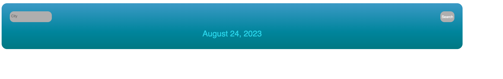
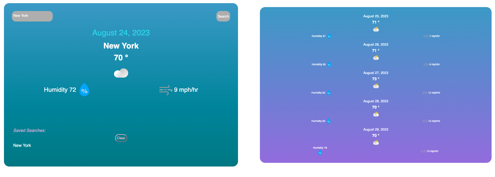
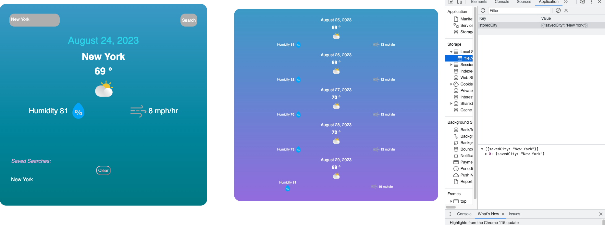
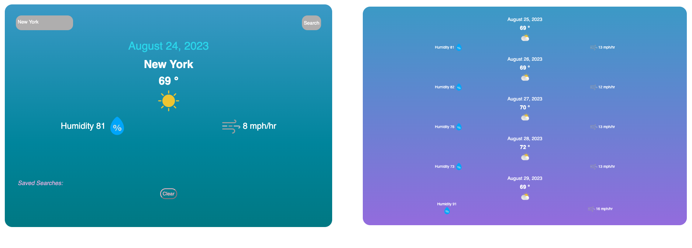
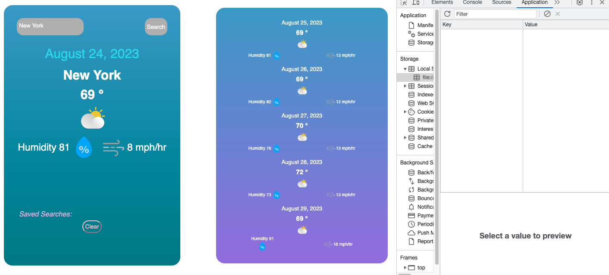

# Weather Application

 

## Description

This website has been created for the purpose of looking up the current weather and the five-day forecast for any city. I called two API’s, one for the current day and the second one for the five-day forecast. Local storage was also used so that the user can have a saved history of the past searches they have made.

 

## Table of Contents

-[User Story](#User-Story)

-[Acceptance Criteria](#Acceptance-Criteria)

-[Installation](#Installation)

-[Technologies Used](#Technologies-Used)

-[My Successes and Challenges](#My-Successes-and-Challenges)

-[User Interface](#User-Interface)

-[Future Development](#Future-Development)

-[Author](#Author)

 

## User Story

```md

AS A traveler

I WANT to see the weather outlook for multiple cities

SO THAT I can plan a trip accordingly

````

 

## Acceptance Criteria

```md

GIVEN a weather dashboard with form inputs

WHEN I search for a city

THEN I am presented with current and future conditions for that city and that city is added to the search history

WHEN I view current weather conditions for that city

THEN I am presented with the city name, the date, an icon representation of weather conditions, the temperature, the humidity, and the the wind speed

WHEN I view future weather conditions for that city

THEN I am presented with a 5-day forecast that displays the date, an icon representation of weather conditions, the temperature, the wind speed, and the humidity

WHEN I click on a city in the search history

THEN I am again presented with current and future conditions for that city

````

 

## User Interface
### Landing Page

### City Look Up Page

### Saved to Local Storage

### Clearing Search History

### Clearing Local Storage


## Installation

-Navigate to my repository: https://github.com/Allicris/weather-app

-Click on the green “Code” Button

-Select SSH and copy

-Open your terminal and navigate to the appropriate folder you want the repository in.

-Type the following in the terminal:

a.     git clone (the ssh key)

b.     cd (repository name)

c.      Type code . to open the repository in VS Code

 ## Links
 Website Link: https://allicris.github.io/new-weather-app/

## Technologies Used

-OpenWeather website for the current day forecast and five-day forecast

-Local Storage

-Google Chrome Dev Extension

 

## My Successes and Challenges

A challenge of mine was being able to get the five-day forecast API to load my data. For the current day forecast I didn’t have much of a problem because I was able to see the properties on the console but I wasn’t able to see the properties for the five-day forecast. I downloaded the Google Chrome Dev extension so that could see the properties of the five-day forecast by inputting my api call in the URL box. This helped a lot but since I never used it I had to take guesses on what was the correct property to call. In the end, I was able to load the data seamlessly, installing the extension was a huge help.

A success of mine was being able to call two API’s in one project, although the five-day forecast API took a little longer, once I got it to work I felt very proud. Although it is not an API from a different website, there was still two calls I had to make. I worked on a project with a group and we worked on a similar project together but being able to successfully do it on my own made me realize how much I had grown and learned. Another success was implementing my UI, I wanted a clean, modern but fun look. I was able to achieve this by using the linear gradient option for my background, before this project I always had solid colors on my projects. Being able to use this made the project fun, I am very proud of how it came out.

 

## Future Development

I would like to fix the search history area, at the moment my clear button is in the middle and although it works, I would like to clean it up. I would also like to make a grid kind of layout for all the results instead of them getting squished together. Another cool thing that I would like to add would be to be able to click on a future date and have it enlarged.

 

## Author

Allison Cristine Serrano